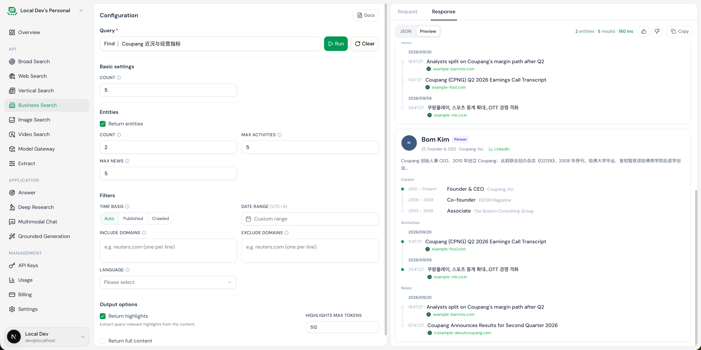

# Business Search 控制台交互

- 新增 Business Search 独立模块

- 支持 Entities 参数选择，开启后，支持设置 count、max\_activities、max\_news 参数

- 点击 Run 后，展示 Business 垂类的搜索结果，包含 Entities、Results 两种

- Entities：展示搜索到的 company 卡片和 person 卡片

    - company 卡片（如果某个字段无数据则不展示）

        - 第一部分展示公司 logo、公司名称、别名、company 标签、官网、LinkedIn地址、股票代码、SEC 编号

        - 第二部分展示 summary、industry、HQ country、founded year、employee range

        - 第三部分展示核心指标数据，包含 stock price及其对应的日期和涨跌幅（仅上市公司）、52\-week high/low、revenue、net income、valution、total funding、monthly visits、country rank

            - 注意：这里的币种需要使用返回结果里对应的币种

        - 第四部分展示Key people、Activities、News（Activities 和 News 的每一条只展示标题、时间、url 即可，同一天的新闻聚合到一起，跟 news search 的展示基本一致）

- Results：展示搜索结果，跟 Web Search 的交互相同

- Entities

    - person 卡片（如果某个字段无数据则不展示）

        - 第一部分展示照片、人名、person 标签、当前职位、当前公司、LinkedIn链接

        - 第二部分展示人物简介

        - 第三部分展示生涯经历（就职时间、职位、公司）

        - 第四部分展示Activities、News（同上）

[business\-search\-demo\.html](图片和附件/business-search-demo.html)

---

## 5. 与 News Search 的核心结构性差异

> 详见完整规范文档：[BUSINESS_SEARCH_SPEC.md](../BUSINESS_SEARCH_SPEC.md)

| 对比维度 | News Search (新闻垂直搜索) | Business Search (商业垂直搜索) |
| :--- | :--- | :--- |
| **1. 业务范式** | **事件驱动（Event-Driven Storyline）** 以“时间”为轴，追踪突发/地缘事件的时序演化 | **实体为中心（Entity-Centric Intelligence）** 以“商业实体”为轴，提炼公司与高管的结构化深度画像 |
| **2. 输出拓扑** | **单层主题树**： `data.subjects[]` 下挂 `articles[]` | **双层复合结构**： ① `data.entities[]`（结构化实体档案） ② `data.results[]`（文本搜索结果，标注 authority 权威等级） |
| **3. 对象模型** | **单一模型**：`Subject`（事件专题） 不区分类型，每个专题均代表一段时序聚合的报道 | **双模型二分**：`Company`（公司卡片） vs `Person`（人物卡片） 公司含股票/财务/高管，人物含当前组织/生平/历史履历 |
| **4. 动态事件分流** | **统一时间线**： 所有媒体报道按时间戳汇聚成一条纵向时间轴（Timeline） | **精准双轨分流**： ① **Activities**（企业官方一手事记：财报/公告/任命）：具因果链，画成**时间线**； ② **News**（第三方媒体报道）：各家独立发声无因果，平铺为**朴素列表** |
| **5. 参数控制** | 侧重时效性窗口、关键词过滤、时间排序 | 增加 **Entities 参数群**： `entities` 开关、`count`、`max_activities`、`max_news` |
| **6. 实体感知保障** | 有相关报道即聚合生成 Subject | **严格实体边界**：Query 若无相关商业实体，Entities 严格返回空数组，前端仅显示普通 Results，绝不拼凑假数据 |
