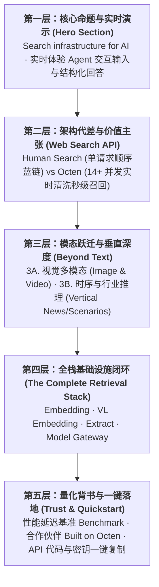

# 📐 Octen 首页正文内容叙事结构优化提案 (Content Structure Proposal)

基于当前项目的物理目录体系（`index.html` 单一数据源运行入口、`public/css/` 与 `public/js/` 静态解耦层、`src/components/` 源码组件层），本提案系统性梳理并提出一套符合开发者从 **建立认知 ➔ 理解代差 ➔ 探索能力 ➔ 考察全栈 ➔ 一键接入** 的五层递进叙事心智模型及工程重构方案。

---

## 🗺️ 一、当前正文结构现状与深度诊断

| 现有区块 (DOM / 组件) | 对应文件位置 | 当前表述痛点与割裂点 |
| :--- | :--- | :--- |
| **Section 2: Hero 首屏** | [index.html](file:///x:/XCoding/Octen/hompage/index.html) 行 164~480 | 首屏交互输入框下方内联了 3 张长达数百行的超长生产数据表格（Domain/Aspect/Platform），导致首屏关键叙事被大幅截断，视觉焦点分散，用户下滑产生阅读疲劳。 |
| **Web Search 架构对比** | [index.html](file:///x:/XCoding/Octen/hompage/index.html) 行 480 尾部<br>[ArchitectureComparison.tsx](file:///x:/XCoding/Octen/hompage/src/components/ArchitectureComparison.tsx) | 紧贴在 Hero 底部，缺乏独立的语义容器 `<section>`、标准上下留白与专属叙事锚点，容易被误认为仅是 Hero 的次级说明。 |
| **Section 3: Modalities (图文混搜)** | [modalities-search.css](file:///x:/XCoding/Octen/hompage/public/css/modalities-search.css)<br>[ImageVideoSearch.tsx](file:///x:/XCoding/Octen/hompage/src/components/ImageVideoSearch.tsx) | 并排架构与视觉还原度高，但与上游 Web Search 之间缺乏承上启下的**从纯文本检索跃迁至视觉/多模态检索**的过渡逻辑。 |
| **Section 4: Vertical Search (垂直推理)** | [vertical-search.css](file:///x:/XCoding/Octen/hompage/public/css/vertical-search.css)<br>[VerticalSearch.tsx](file:///x:/XCoding/Octen/hompage/src/components/VerticalSearch.tsx) | 5 步动画极强，但目前主要以 News 为单一范例，其他场景（Legal、Finance 等）在底部跑马灯弱化，未能充分突出“高精度垂直推理”的核心卖点。 |
| **Section 5: Retrieval Stack (全栈基建)** | [RetrievalStack.tsx](file:///x:/XCoding/Octen/hompage/src/components/RetrievalStack.tsx)<br>[index.html](file:///x:/XCoding/Octen/hompage/index.html) #api-introduce | 采用平铺卡片呈现，缺乏与上层搜索 API 协同闭环的解释（即：实时搜索 ➔ 内容清洗 Extract ➔ 多模态嵌入 Embedding ➔ 模型网关 Gateway 的端到端流转）。 |

---

## 📐 二、建议的正文内容叙事结构（五层递进心智模型）

建议将整页正文重塑为一条符合开发者决策逻辑的线性递进动线：



---

### 1. 第一层：核心命题与实时演示 (Hero Section)
- **定位**：3 秒内建立核心认知与视觉震撼。
- **核心叙事**：
  - **品牌主标**：`Search infrastructure for AI`
  - **核心特性**：`Real-time indexing | Low latency | High reliability`
  - **交互体验**：首屏核心搜索框，支持用户实时输入或点击测试 Query，即时展开 Answer 与 Sources 双栏响应（结构化呈现、毫秒级延迟计数）。
- **优化调整建议**：
  - 将内联在首屏下方的 3 张超长生产表格（Domain、Aspect、Platform）剥离出首屏主视觉，移至专属 Benchmark 区域或采用交互式抽屉/标签页收折，确保首屏聚焦在 **“实时 AI 检索”** 的核心体验上。

---

### 2. 第二层：架构代差与价值主张 (Web Search 架构对比)
- **定位**：回答“为什么通用搜索引擎无法满足 AI Agent”。
- **核心叙事**：
  - **模块标语**：`General Search` / `Fresh context, returned in milliseconds.`
  - **核心对比卡片**：
    - **Human Search (传统检索)**：为人类浏览设计的单关键词管道（Sequential Pipeline），逐页爬取，返回冗余且需要人工甄别的静态网页蓝链。
    - **Octen Search (Agent 专属搜索)**：针对 LLM 推理场景，将复杂意图智能裂变为 **14+ 并发子查询（Concurrent Execution）**，毫秒级直接回传结构化、无噪点的纯净上下文。
  - **底层技术胶囊**：展示 10 大核心检索范式标签（`Semantic search`、`Hybrid search`、`Vector databases` 等）。
- **优化调整建议**：
  - 在 [index.html](file:///x:/XCoding/Octen/hompage/index.html) 中将该区域规范为独立的 `<section id="web-search">`，配置标准的上部呼吸间距（`padding: 100px 0`），并赋予与深色背景协调的立体微光描边，形成强视觉冲击力的分水岭。

---

### 3. 第三层：能力的广度与深度 (Modalities & Vertical Search)
- **定位**：解决开发者“除了通用文本，还能搜什么、搜得多深”的疑问。
- **3A. 广度维度（Search Beyond Text - 多模态检索）**：
  - 承上启下过渡：“文本只是第一步，多模态 Agent 需要直接理解物理世界的视觉信息”。
  - [Image & Video Search](file:///x:/XCoding/Octen/hompage/src/components/ImageVideoSearch.tsx)：保持现有的高精双列并排，展示视觉特征比对、视频帧级精准动作定位能力。
- **3B. 深度维度（Vertical Search - 时序与专业领域推理）**：
  - 突出“秒级新闻脉络追踪”与“高精度垂直场景探索”。
  - [Vertical Search](file:///x:/XCoding/Octen/hompage/src/components/VerticalSearch.tsx)：5 步动态打字机与时间轴轨道（News 示例），配合底部 `More scenarios in future releases` 跑马灯（金融、法律、代码、学术）。

---

### 4. 第四层：底座能力完整闭环 (The Complete Retrieval Stack)
- **定位**：展示端到端检索工具箱，消除开发者对第三方清洗/切片工具的依赖顾虑。
- **核心叙事**：
  - **标语**：`Beyond Search: The Complete Retrieval Stack`
  - **四大件有机闭环**：
    1. **Extract**：任意网页输入，瞬时提取去噪的干净 Markdown 与核心摘要；
    2. **Embedding & VL Embedding**：统一高维语义空间，打通文本、图片与视频混合表征；
    3. **Model Gateway**：统一调度主流顶尖大模型，无缝集成 Octen 检索上下文。
- **优化调整建议**：
  - 增强四大组件之间的“数据流箭头”，直观呈现从“网页抓取 ➔ 格式清洗 ➔ 向量嵌入 ➔ 模型生成”的完整工作流。

---

### 5. 第五层：信任背书与转化行动 (Trust, Benchmarks & Quickstart)
- **定位**：提供量化验证，消除接入顾虑，促成立即调用。
- **核心叙事**：
  - **权威基准 (Benchmarks)**：展示 P50/P99 延迟对比曲线、事实准确率与幻觉抑制指标（可收纳原 Hero 处移出的生产数据表格）。
  - **生态见证 (Built on Octen)**：展示顶尖 AI 创业团队与企业级客户用例。
  - **开发者极速接入 (Quickstart)**：
    - 直接提供可交互、可一键复制的终端代码（`curl`、`Python SDK`、`TypeScript SDK`）。
    - 显著的 `Get API Key` 与 `View Docs` 行动召唤按钮（CTA）。

---

## 📂 三、对应的工程文件组织优化方案

为保证前端代码架构与上述叙事结构 1:1 精确映射，建议后续模块化目录演进如下：

```text
x:\XCoding\Octen\hompage\
├── public/
│   ├── css/
│   │   ├── navbar.css              # 1. 顶部导航样式 (含 Products & Developers 菜单)
│   │   ├── hero.css                # 2. Hero 区域专属样式 (解耦独立)
│   │   ├── web-search.css          # 3. 架构对比 (Human vs Octen) 专属样式
│   │   ├── modalities-search.css   # 4. 图文并排多模态样式 (已就绪)
│   │   ├── vertical-search.css     # 5. 垂直搜索 5 步动画与时间轴样式 (已就绪)
│   │   ├── retrieval-stack.css     # 6. 全栈底座组件样式
│   │   └── footer.css              # 7. 页脚样式 (已就绪)
│   ├── js/
│   │   ├── navbar.js               # 导航交互控制器
│   │   └── vertical-search.js      # 时间轴与跑马灯控制器
│   └── assets/                     # 高精度矢量 SVG 与多媒体资产
├── src/
│   └── components/
│       ├── Navbar.tsx
│       ├── Hero.tsx
│       ├── ArchitectureComparison.tsx   # 对应 Web Search 对比
│       ├── ImageVideoSearch.tsx
│       ├── VerticalSearch.tsx
│       ├── RetrievalStack.tsx
│       ├── BenchmarkSection.tsx         # 集中收纳基准表格
│       ├── QuickstartSection.tsx        # 代码接入终端
│       └── Footer.tsx
├── handoff.md                      # 上下文交接与设计决策
└── index.html                       # 线性清晰编排的单一运行入口
```

---

## 💡 四、核心落地行动建议

1. **结构瘦身**：将当前 [index.html](file:///x:/XCoding/Octen/hompage/index.html) 中膨胀的 Section 2 拆分为独立的 **Hero** 与 **Web Search 对比** 两个语义容器，消除数百行未折叠表格对首屏流程度的阻碍。
2. **逻辑桥接**：在各 Section 头部补充简练而有力的“承上启下”过渡文案，形成“文本检索 ➔ 视觉多模态 ➔ 垂直时间轴 ➔ 底层工具链 ➔ 落地调用”的顺畅心智动线。
3. **双轨同步**：任何结构的更新均需遵循项目规范，保持 `index.html` 运行入口与 `src/components/*.tsx` React 源码组件双端严格对齐。
